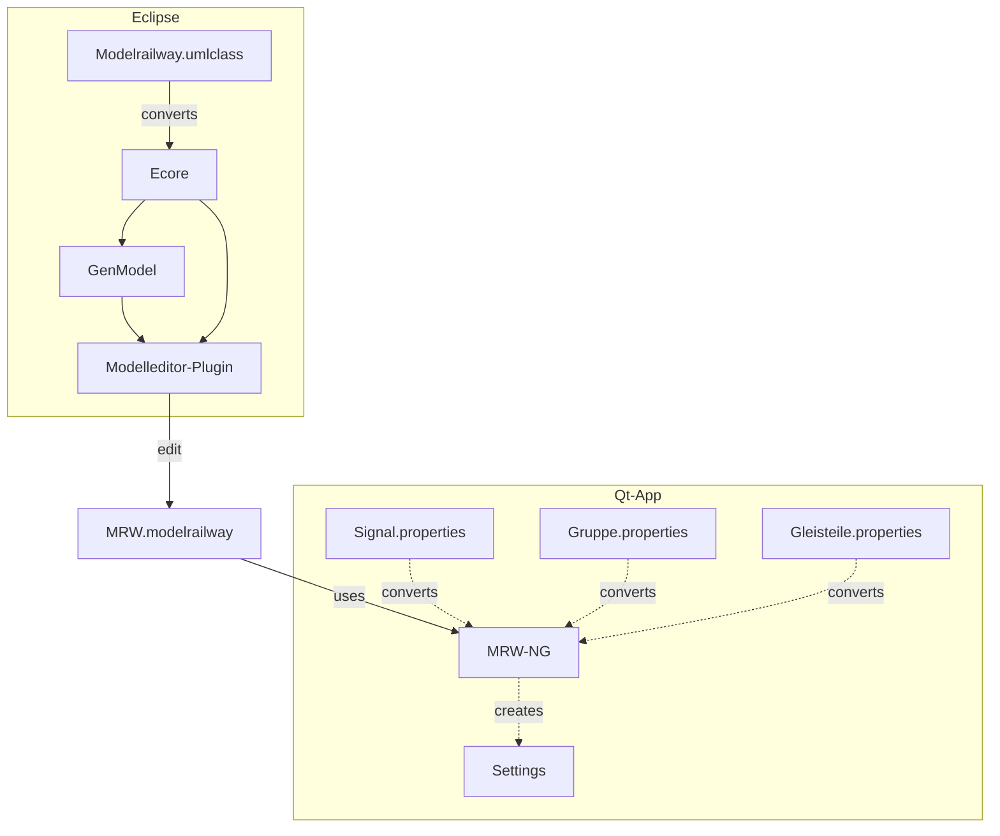

# MRW Track Control NG
This is the next generation Qt based track control software based on the MRW
project. It reads the modelrailway file, which is XML/XMI based and displays
the GUI to control the model railway.

## Data flow archtecture



## Installation

To install precompiled software on your ubuntu system you have to prepare
the APT subsystem. First you have to download the keyring:

<pre style="white-space: nowrap;">
sudo wget -O /etc/apt/trusted.gpg.d/mrw.gpg http://eisenbahnsteuerung.org/mrw.gpg
</pre>

Now you can add an entry into your *sources.list* file, but it is better to
put the line into its own file (*/etc/apt/sources.list.d/mrw.list*):

<pre style="white-space: nowrap;">
deb [signed-by=/etc/apt/trusted.gpg.d/mrw.gpg] http://eisenbahnsteuerung.org/apt/ mrw common firmware
</pre>

After that you can update and install the software:
```
sudo apt update
sudo apt install mrw-ng
```
