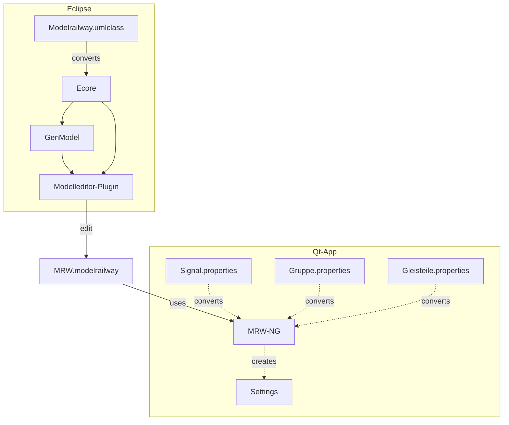
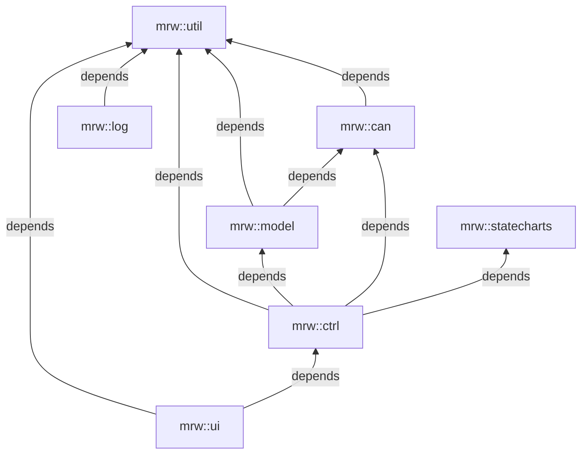

# MRW Track Control NG
This is the next generation Qt based track control software based on the MRW project. It reads the modelrailway file, which is XML/XMI based and displays the GUI to control the model railway.

## Data flow architecture



## Installation

To install precompiled software on your ubuntu system you have to prepare
the APT subsystem. First you have to download the keyring:

<pre style="white-space: nowrap;">
sudo wget -O /etc/apt/trusted.gpg.d/mrw.gpg http://eisenbahnsteuerung.org/mrw.gpg
</pre>

Now you can add an entry into your *sources.list* file, but it is better to
put the line into its own file (*/etc/apt/sources.list.d/mrw.list*):

<pre style="white-space: nowrap;">
deb [signed-by=/etc/apt/trusted.gpg.d/mrw.gpg] http://eisenbahnsteuerung.org/apt/ mrw common firmware
</pre>

After that you can update and install the software:
```
sudo apt update
sudo apt install mrw-ng
```

## Building the project

You have two choices building the complete project *qmake*/*qmake6* or
*cmake*. Except with *qmake6* you can also cross compile the project for
different target architectures.

### qmake
For a host build you can simply build the project using the following command sequence:
```
qmake
build -j `nproc`
```
Instead of using *qmake* for Qt5 you can use *qmake6* which selects Qt6.
Both Qt versions can coexist on the host development machine.

For cross builds using Qt5 you need a custom target development build of Qt.
This build contains host binaries for preparing the build such as *qmake*,
*moc* or *uic* and target headers and libraries for compiling and linking.
So the sysroot does not need any Qt package installation. See the Qt Wiki
for more details for creating such a cross built Qt. You can cross build
this project using the following sequence:
```
<path-to-dev-qt>/bin/qmake
build -j `nproc`
```
Note that the target architecture and their paths is encoded into the cross built Qt.

### cmake
Since Qt6 will end support for *qmake* in the future there is also a *cmake*
build possibility. This *cmake* build does not support Qt5 anymore. There is
also a simple way to cross compile this project. To build this project
simply use the usual command sequence:
```
cmake -B build
cmake --build --parallel
```
For cross builds the sysroot needs the installation of the Qt6 development
packages. The build needs three more variables. One for defining the
toolchain file which describes the cross compiler and the sysroot as usual.
```
cmake -B build -DQT_HOST_PATH=/ \
	-DQT_HOST_PATH_CMAKE_DIR=/usr/lib/x86_64-linux-gnu/cmake \
	-DCMAKE_TOOLCHAIN_FILE=<fq-path-to-toolchain-file> 
cmake --build --parallel
```

### Starting the application
To start the track control software refer to the
[README](./track-control/README.md) of the MRW-TrackControl application. It
additionally contains information about configuring the CAN bus and prepare
the EGL on Raspberry Pi mini computers.

## Software packages and namespaces

The software is organized in packages each using its own namespace. Every package result in a static library. There are the following packages:
* mrw::util, libMRW-Util.a which contains convenience classes.
* mrw::log, libMRW-Log.a which contains logging classes.
* mrw::can, libMRW-Can.a which contains the CAN support.
* mrw::model, libMRW-Model.a which contains the data model of model railways.
* mrw::ctrl, libMRW-Ctrl.a which contains logic classes.
* mrw::ui, libMRW-UI.a which contains widgets for graphical interaction.
* mrw::statecharts, libMRW-Statecharts.a which contains state machines supporting the controller classes.

The packages have dependencies as shown in the following diagram:

