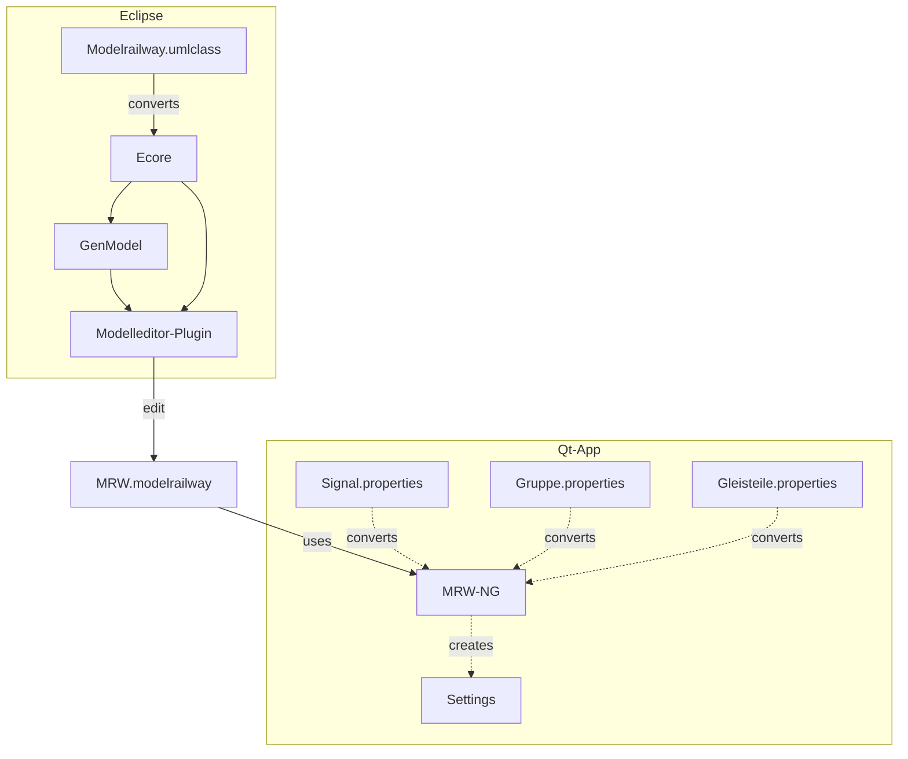
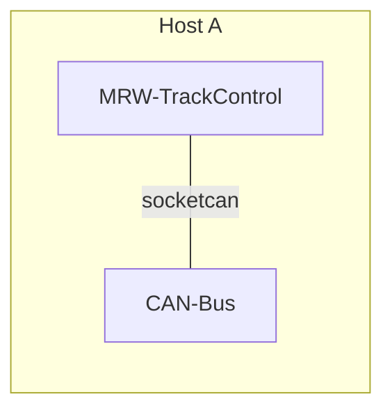
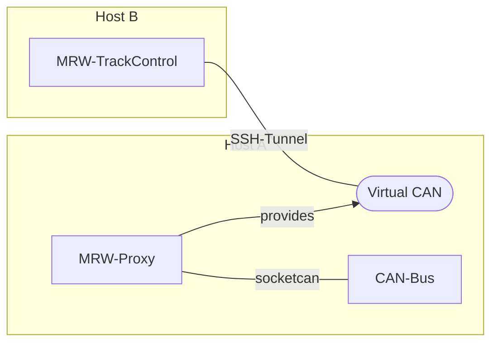
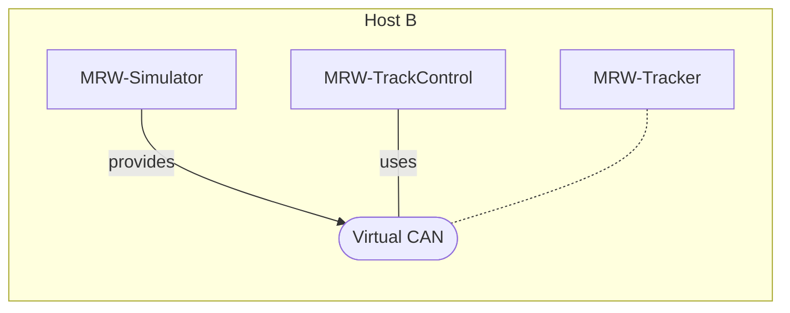
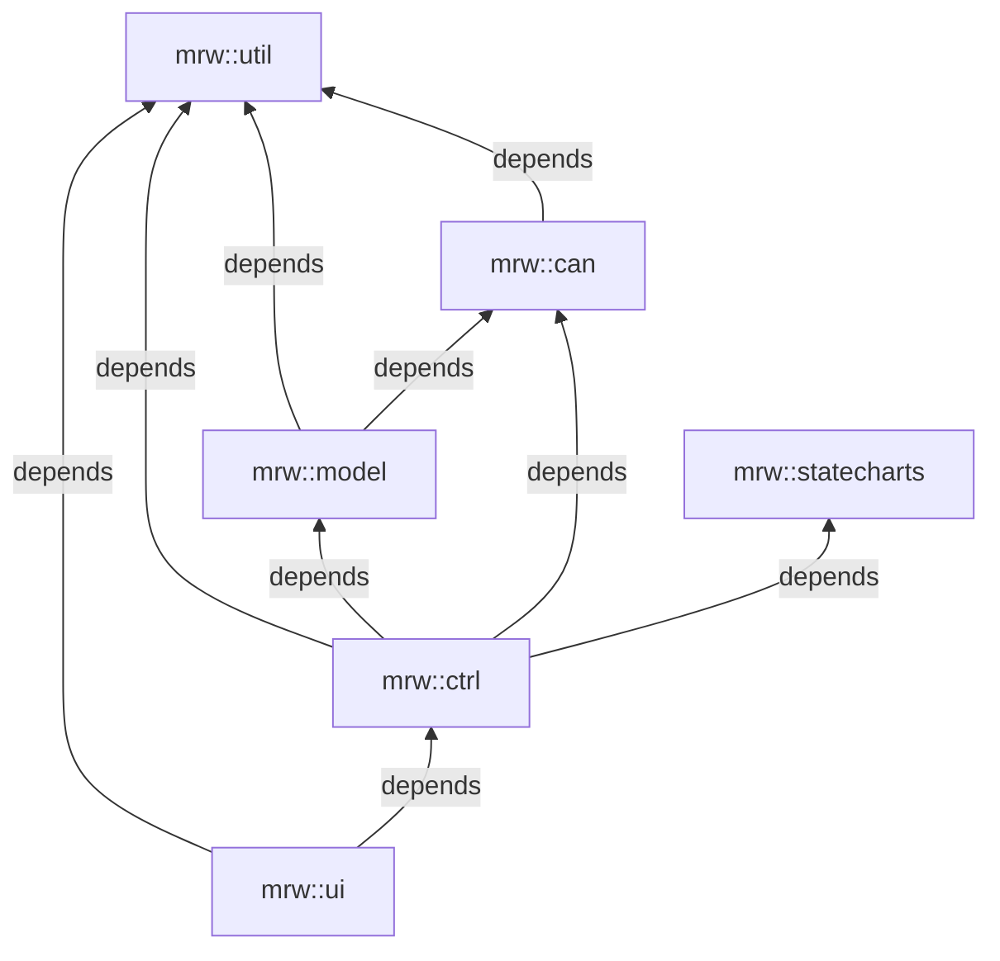

# MRW Track Control NG
This is the next generation Qt based track control software based on the MRW
project. It reads the modelrailway file, which is XML/XMI based and displays
the GUI to control the model railway.

## Data flow architecture



## Installation

To install precompiled software on your ubuntu system you have to prepare
the APT subsystem. First you have to download the keyring:

<pre style="white-space: nowrap;">
sudo wget -O /etc/apt/trusted.gpg.d/mrw.gpg http://eisenbahnsteuerung.org/mrw.gpg
</pre>

Now you can add an entry into your *sources.list* file, but it is better to
put the line into its own file (*/etc/apt/sources.list.d/mrw.list*):

<pre style="white-space: nowrap;">
deb [signed-by=/etc/apt/trusted.gpg.d/mrw.gpg] http://eisenbahnsteuerung.org/apt/ mrw common firmware
</pre>

After that you can update and install the software:
```
sudo apt update
sudo apt install mrw-ng
```

## Running Track Control
You can start the track control software by starting:
```
MRW-TrackControl <railway-model>
```
Note that you don't have to add a file extension! The software lookups the
railway model file in your complete home directory. Once it is found it
remembers the location and you don't have to add the railway-model as
argument.

To create an appropriate railway model consult the pages of https://github.com/stmork/mrw/

### Direct usage

So the simplest scenario to start MRW-TrackControl is as follows:



### Remote usage

If you want to use MRW-TrackControl remotely you can use the MRW-Proxy tool
which interconnects a real CAN-Bus (the "socketcan" plugin in Qt meaning)
with a virtual CAN-Bus (the "virtualcan" plugin in Qt meaning). Since the
virtual CAN-Bus can only connect to a localhost socket you need a SSH tunnel
to connect remotely. You can use the command on host B to build a tunnel to
host A:

```
ssh -L 35468:localhost:35468 user@host-a
``` 

Note that you start the MRW-Proxy tool first, since it provides the virtual
CAN Server on socket localhost:35468.



### Simulation

If you want to simulate a model railway you can use the MRW-Simulator tool.
This tool has to be started first, because the tool provides the virtual CAN
Server on socket localhost:35468. All following tools detect the virtual
CAN-Bus server and connect automatically. The MRW-Tracker ist optional and
simulates a train following a track of enabled rail sections during a
selected tour/route.



## Software packages and namespaces

The software is organized in packages each using its own namespace. Every package result in a static library. There are the following packages:
* mrw::util, libMRW-Util.a which contains convenience classes.
* mrw::can, libMRW-Can.a which contains the CAN support.
* mrw::model, libMRW-Model.a which contains the data model of model railways.
* mrw::ctrl, libMRW-Ctrl.a which contains logic classes.
* mrw::ui, libMRW-UI.a which contains widgets for graphical interaction.
* mrw::statecharts, libMRW-Statecharts.a which contains state machines supporting the controller classes.

The packages have dependencies as shown in the following diagram:

