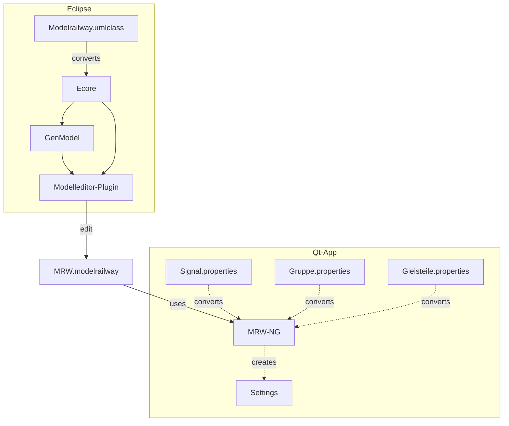

# MRW Track Control NG
This is the next generation Qt based track control software based on the MRW
project. It reads the modelrailway file, which is XML/XMI based and displays
the GUI to control the model railway.

## Data flow archtecture

