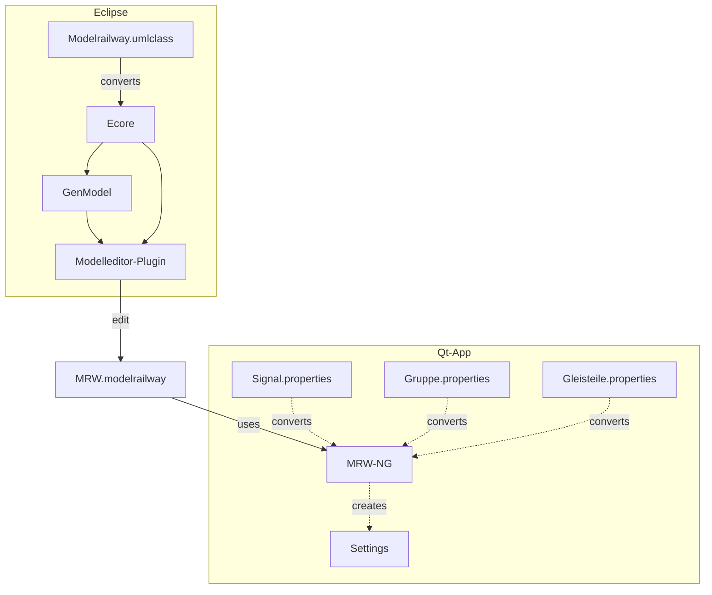
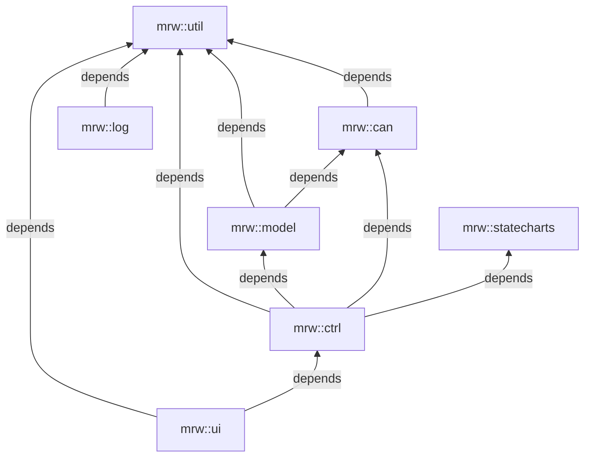

# MRW Track Control NG
This is the next generation Qt based track control software based on the MRW project. It reads the modelrailway file, which is XML/XMI based and displays the GUI to control the model railway.

## Data flow architecture



## Installation

To install precompiled software on your ubuntu system you have to prepare
the APT subsystem. First you have to download the keyring:

<pre style="white-space: nowrap;">
sudo wget -O /etc/apt/trusted.gpg.d/mrw.gpg http://eisenbahnsteuerung.org/mrw.gpg
</pre>

Now you can add an entry into your *sources.list* file, but it is better to
put the line into its own file (*/etc/apt/sources.list.d/mrw.list*):

<pre style="white-space: nowrap;">
deb [signed-by=/etc/apt/trusted.gpg.d/mrw.gpg] http://eisenbahnsteuerung.org/apt/ mrw common firmware
</pre>

After that you can update and install the software:
```
sudo apt update
sudo apt install mrw-ng
```
## Starting the application
To start the track control software refer to the [README](./track-control/README.md) of the MRW-TrackControl application.

## Software packages and namespaces

The software is organized in packages each using its own namespace. Every package result in a static library. There are the following packages:
* mrw::util, libMRW-Util.a which contains convenience classes.
* mrw::log, libMRW-Log.a which contains logging classes.
* mrw::can, libMRW-Can.a which contains the CAN support.
* mrw::model, libMRW-Model.a which contains the data model of model railways.
* mrw::ctrl, libMRW-Ctrl.a which contains logic classes.
* mrw::ui, libMRW-UI.a which contains widgets for graphical interaction.
* mrw::statecharts, libMRW-Statecharts.a which contains state machines supporting the controller classes.

The packages have dependencies as shown in the following diagram:

