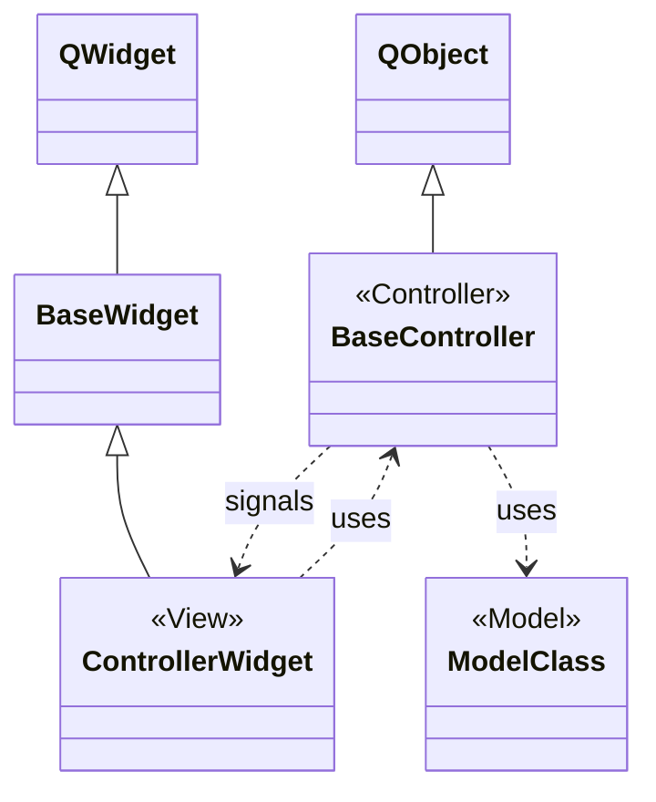
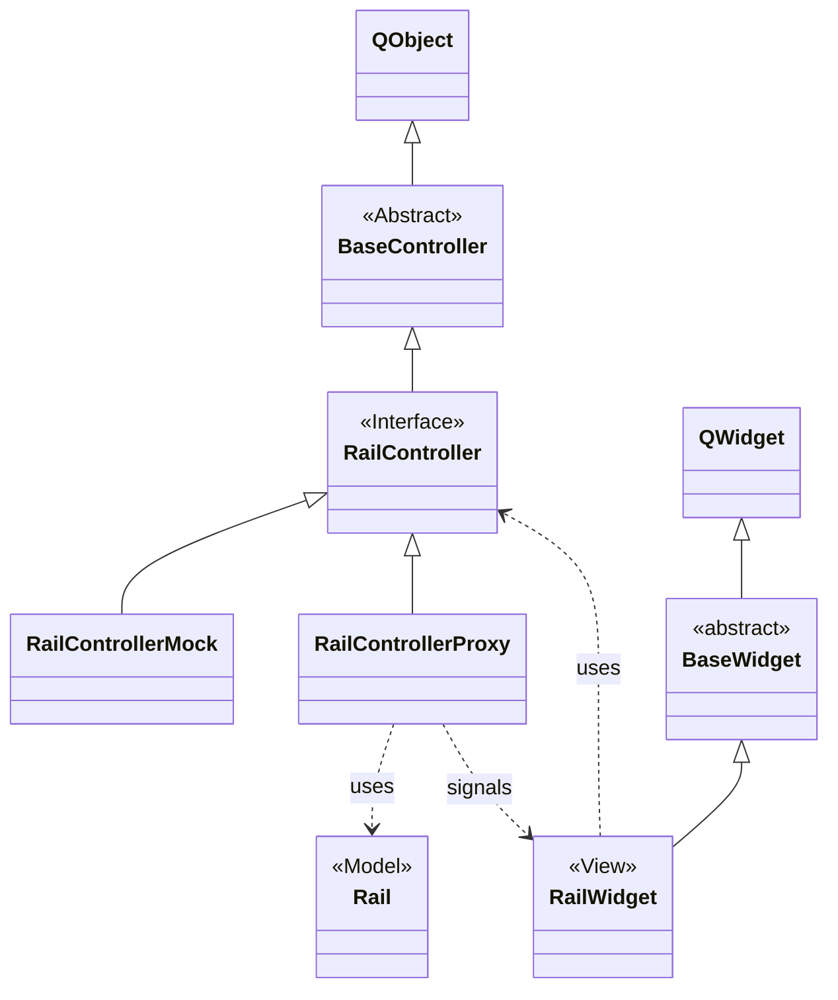

# The mrw::ctrl namespace

The mrw::ctrl namespace contains all controller classes in the meaning of the MVC paradigma (see: https://en.wikipedia.org/wiki/Model%E2%80%93view%E2%80%93controller). The model contains simply the data. The view represents simply this data. Both don't talk directly but using an intermediate controller which contains a sort of business logic. Generally speaking the "view" BaseWidget does not see any model class.

The model may be any class from the mrw::model namespace, The view classes are in the mrw::ui namespace and the controller classes are in this mrw::ctrl namespace.

Actually there are four MVC groups:
1. Section - SectionController - SectionWidget
2. RegularSwitch - RegularSwitchController - RegularSwitchWidget
3. DoubleCrossSwitch - DoubleCrossSwitchController - DoubleCrossSwitchWidget
4. Signal - SignalController - SignalWidget

The MVC for signals is a little bit different because a controller may represent a group of signals like a combined main and distant signal.

## RailController

As an example this scenario shows the MVC for a rail.

The real life MRW-TrackControl software uses the RailControllerProxy which uses the real railway model data. The RailControllerMock acts as a test structure to test the handling of the RailWidget instead while using the MRW-WidgetStudy app. This app simulates the data acces through a control panel.

The Proxy and Mock classes are used for switches and signals in the same manner. These classes are not included into this library package. You can find the Mock classes in the MRW-WdigetStudy scope but in the same mrw::ctrl namespace. The Proxy classes are included in the MRW-TrackControl scope as well.

Note that the Proxy classes uses statemachines as logic. They are included in the mrw::statecharts namespace.