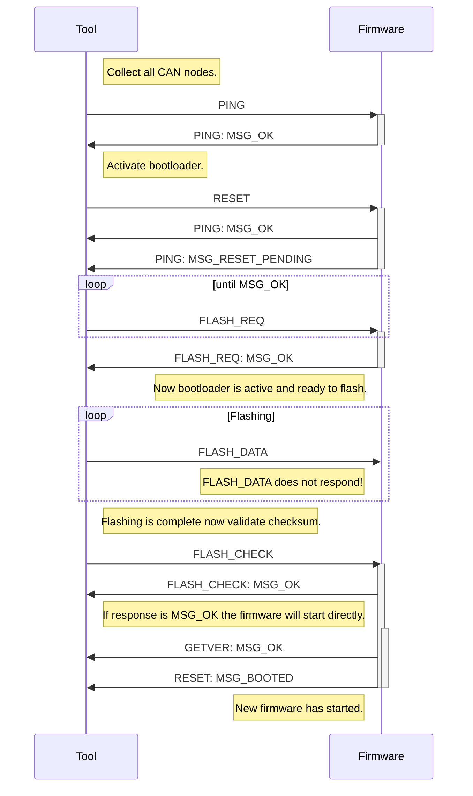

# The MRW-Update tool
The MRW-Update tool updates the firmware of all connected CAN controllers.
The tool uses the firmware file located in
*/lib/firmware/mrw/mrw-firmware-m32.hex*. There is no need for any model file
since tool collects the IDs of all CAN controllers using the PING command.
After that it is expected that all controllers will answer to any request
command.

In detail the commands occur as follows:

