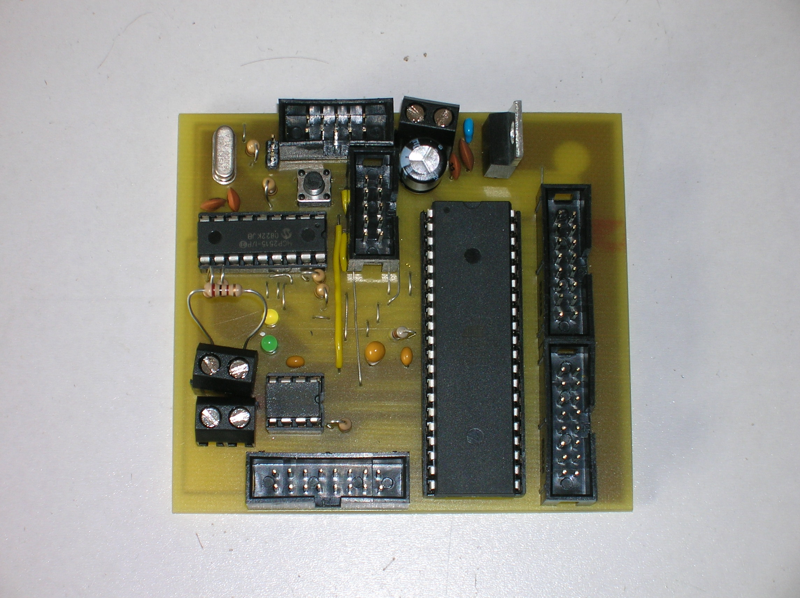
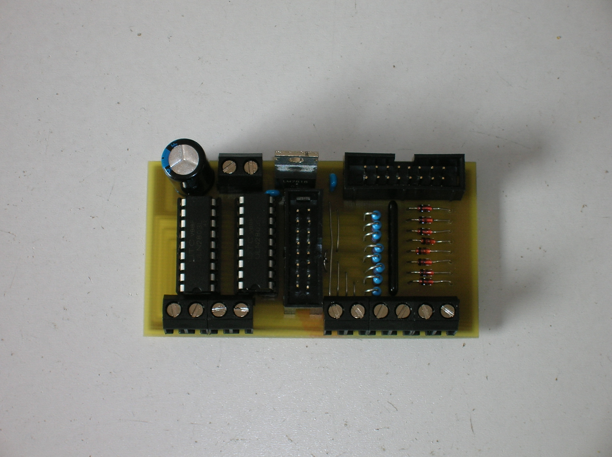
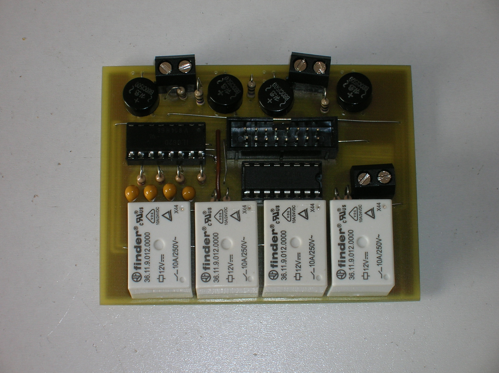
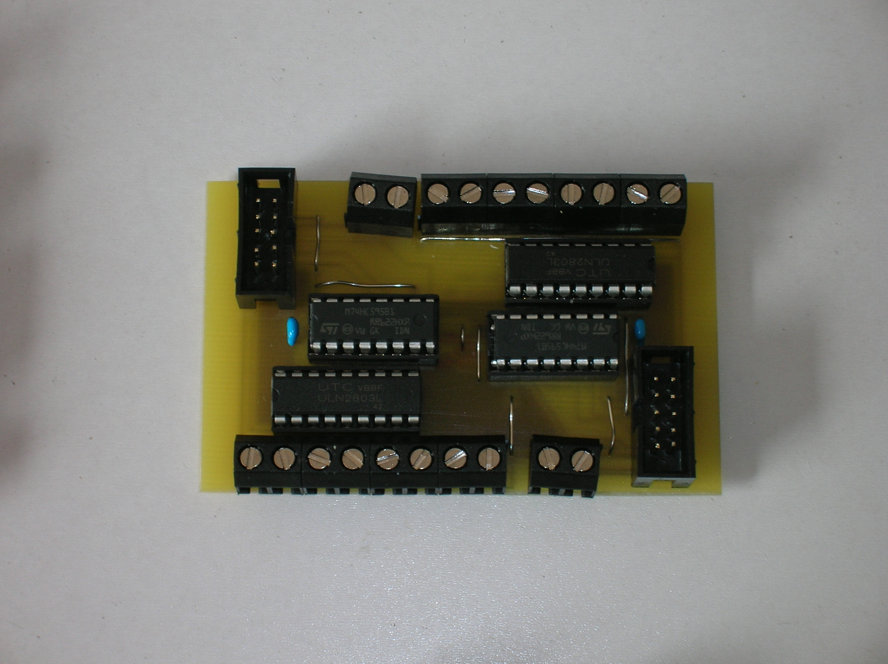

# The CAN node
The CAN node controls the connected passive modules
via ribbon calble connectors. There are three connectors
to connecto to the rail section module or the switch module.
Note that the switch module may need two connectors. One to
turn switches and one to sensor the switch state.

## The switch module
The switch module contains electronics to turn switches and
to indicate the switch position. The switch module can control
up to four switches. It can also control old fashioned semaphores
with up to three coils. You can mix sempaphores with switches.

## The rail section module
The rail section module controls four rail sections. It can
activate power on rails for locomotive drive and can also
indicate occupation on that rail section.

## The multiplex module
The multiplex module can control light signals as well as house
lighting. Depending on the containing signal lights you can
connect up to eight light signals.

