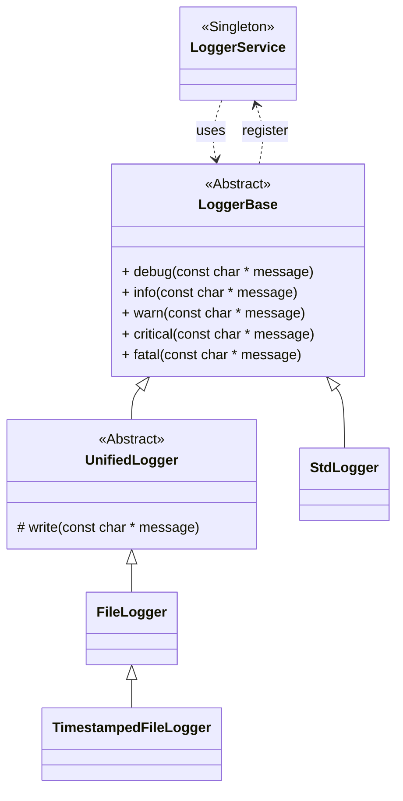

# The mrw::log namespace

The mrw::log namespace provieds classes vor convenient Qt logging. You can register multiple LoggerBase instances into the LoggerService singleton. The logging methods of each LoggingBase instance is called in the order of their registration.

