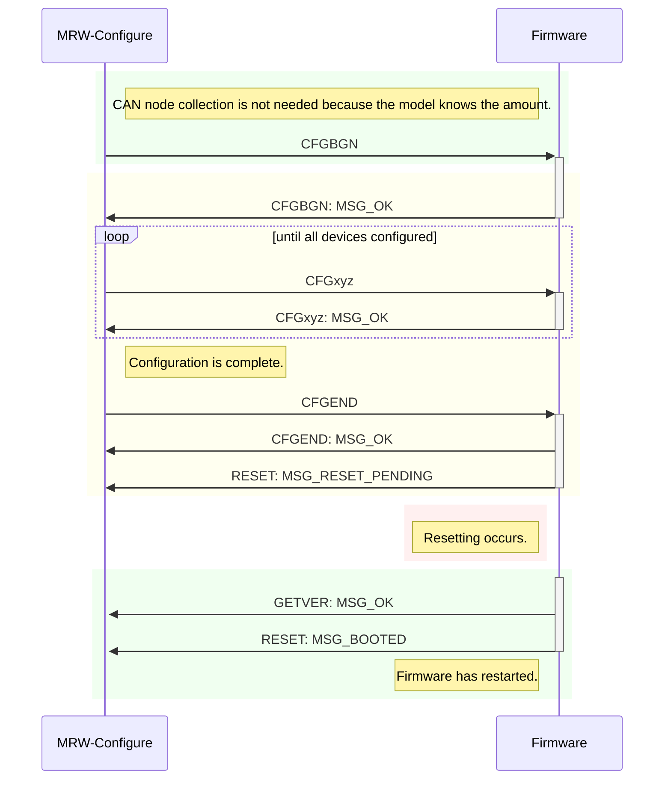
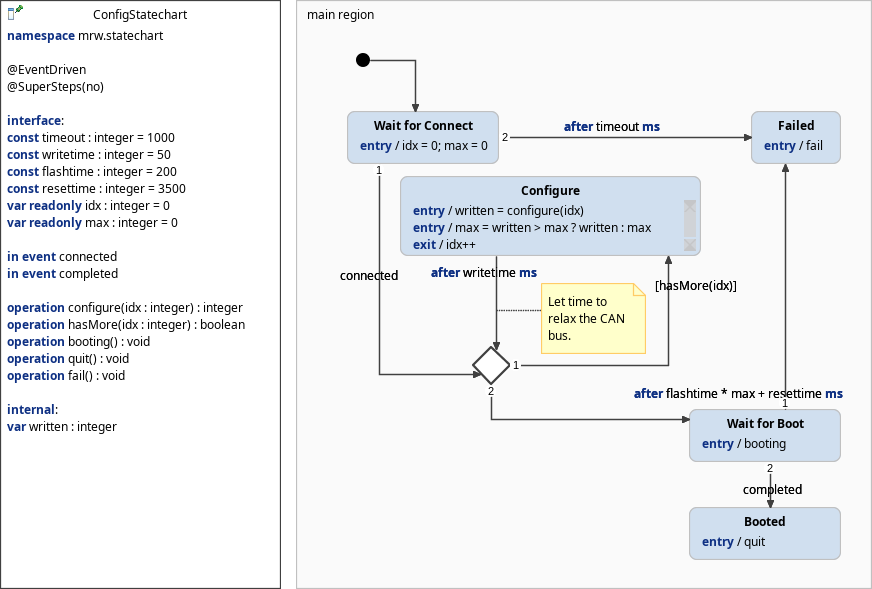

# The MRW-Configure tool
The MRW-Configure tool configures the model railways devices it should control. Up to 44 devices are allowed. To configure the CAN controllers a model railway needs to be read.

## Program flow
Each controller is handled seperately. There occure no broadcast sending.1. To configure a CAN controller it has to enter the configuration by sending an addressed CFGBGN (config begin) command.
2. All devices to be configured have their own CFG command. Up to 44 devices are allowed. By repeatedly sending these CFG commands the CAN controller collects the device configuration.
3. The configuration mode ends with a final CFGEND (config end) command. The data is written into enternal EEPROM which takes about 150 ms for each device. Yes, EEPROM writing is slow!
3. After writing the device configuration into EEPROM the controller sends a CFGEND / MSG_OK response and additionally the amount of devices configured.
5. After completing the device configuration the normal firmware execution starts resulting in RESET / MSG_BOOTED and GETVER / MSG_OK responses.

## Sequence diagram
This diagram shows the following sequence diagram. The green areas are the firmware runtime, the yellow area is while configuring and the red area is the bootloader runtime.

## Statechart

The configuration behaviour of the MRW-Configure tool is controlled by the following statechart:

