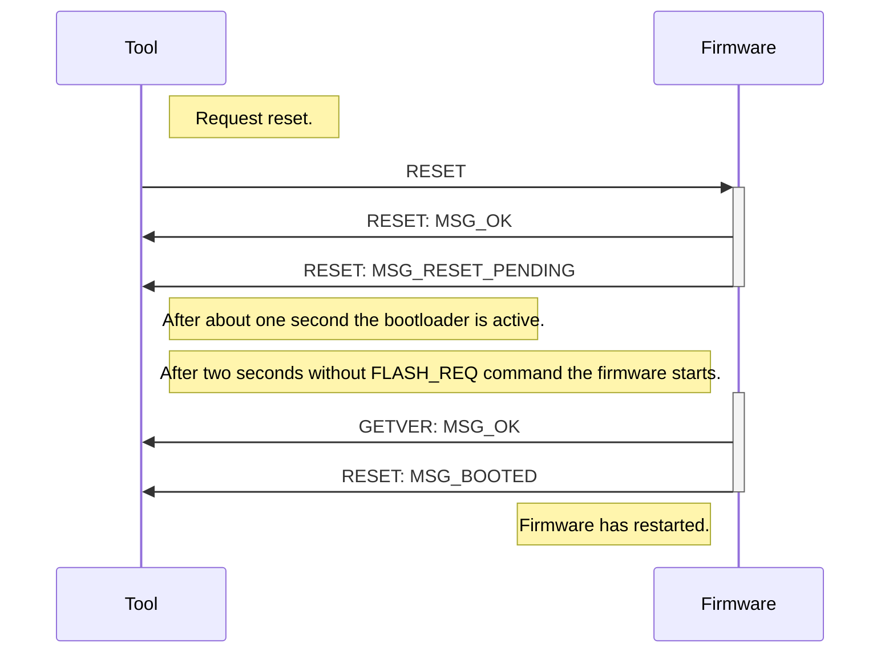

# The MRW-Reset tool
The MRW-Reset simply restarts all connected CAN controllers by sending a broadcast RESET command.

## Program flow
1. Send a broadcast RESET. Now all CAN controllers are resetting and after that entering the bootloader mode. Ech CAN controller respond twice by sending a RESET / MSG_OK and a RESET / MSG_RESET_PENDING response. These answeres are registered.
2. The bootloader itself does not send anything. The bootloader accept FLASH_REQ commands for two seconds. If no FLASG_REQ command was sent the normal firmware starts.
3. Since there was no request for flashing the normal firmware start execution resulting in RESET / MSG_BOOTED and GETVER / MSG_OK responds. If all CAN controllers responded the tool stops execution.

This diagram shows the following sequence diagram:

