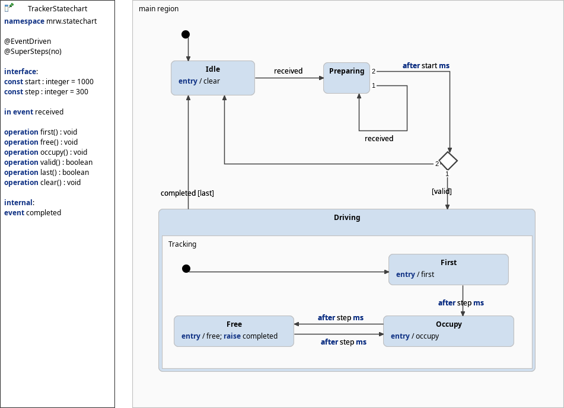

# The MRW-Tracker tool
The MRW-Tracker scans the CAN bus for section activation, reads them in reverse order and gives occupation messages to simulate a moving train. It is a tool to test automatic route deallocation and freeing sections.

**Note:** You have to start the MRW-Simulator tool first. After that you can start MRW-TrackControl or/and this MRW-Tracker in any order you want.

## Program flow
If section activation occur during route computation the activation is reversed. So it is possible to simulate a moving train.
1. Occupy first section.
2. Advance by occupying the next section
3. Leva section.
4. Loop until last section is reached.

**Notes:**
1. It is not possible simulatte route extension.
2. Before starting a further route simulation you have to wait for more than one second. This is used during the beer mode to make tests with this tool available.

## Statechart
The internal behaviour is controlled by the following statechart:

