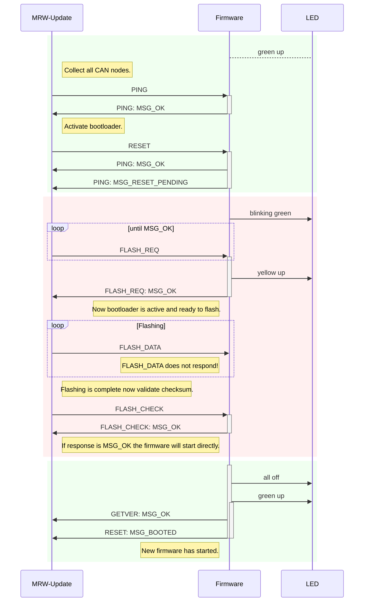

# The MRW-Update tool
The MRW-Update tool updates the firmware of all connected CAN controllers.
The tool uses the firmware file located in file
*/lib/firmware/mrw/mrw-firmware-m32.hex*. There is no need for any model file since tool collects the IDs of all CAN controllers using the PING command. After that it is expected that all controllers will answer to any request command.

## Program flow
1. Send a broadcast PING. All answering CAN controllers are registered by its ID.
2. Send a broadcast RESET. Now all CAN controllers are resetting and after that entering the bootloader mode. A fail is registered if not all controllers send a MSG_RESET_PENDING.
3. The bootloader itself does not send anything. So we have to try responsiveness by sending the FLASH_REQ command. If all controllers have
answered with a MSG_OK response all controllers are ready to flash. The bootloader accept FLASH_REQ commands for two seconds. After that the normal firmware is started.
4. The firmware is sent using the broadcast FLASH_DATA command. Note that this command never responds for performance reason. If the controllers would respond there would be the multiple of controller count traffic occuring on CAN bus. After sending a complete flash page there is a small time gap so the controllers can flash the sent data into memory.
5. After completing the firmware sending the checksum validation happens by sending the FLASH_CHECK command with the assumed checksum. If the checksum is OK the controllers respond with a MSG_OK and enter normal firmware execution resulting in RESET / MSG_BOOTED and GETVER / MSG_OK responses. If the checksum is not OK the bootloader remains active to give the chance of a flash retry. Note that this tool does not support this
feature.

## LED states

During a boot cycle with or without flashing a new firmware the LEDs indicates the internal operation state:

green|yellow|remakrs
----|----|---------
blinking|off|Bootloader waits for flash request.
off|cont.|Bootloader is flashing new firmware.
cont.|blinking|Bootloader waits for reset, no firmware flashed, yet.
off|off|Firmware waits for reset.
cont.|off|Firmware executing.
cont.|cont.|Firmware executing, CAN error occured.

## Sequence diagram
This diagram shows the following sequence diagram. The green areas are the firmware runtime and the red area is the booltloader runtime.

## Statechart
The flashing behaviour of the MRW-Update tool is controlled by the following statechart:

