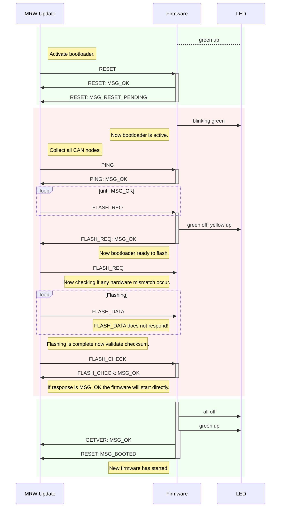
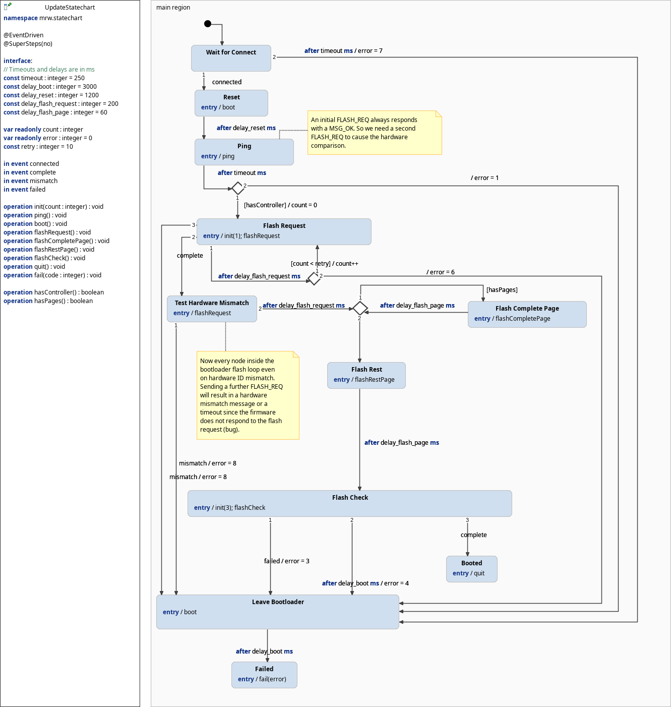

# The MRW-Update tool
The <code>MRW-Update</code> tool updates the firmware of all connected CAN controllers. The tool uses the firmware file located in file */lib/firmware/mrw/mrw-firmware-m32.hex*. There is no need for any model file since the tool collects the IDs of all CAN controllers using the PING command. After that it is expected that all controllers will answer to any request command.

## Bootloader Bug
There are severeal quirks concerning the hardware ID. The CAN nodes has a jumper to configure two different hardware configurations. When sending the FLASH_REQ command the first byte of the payload is this hardware ID and the last three bytes are the Atmel MPU identifier. The idea is that the firmware to update has to be equal to this combined ID. Unfortunately the bootloader does not check this signature correctly.

1. The first FLASH_REQ received by the bootloader is always ansered with a MSG_OK response.
2. All subsequent FLASH_REQ commands are answered by a MSH_HARDWARE_MISMATCH if the hardware signature does not match or no response in case of a hardware match.
3. The normal firmware responds to e FLASH_DATA command with a MSG_IGNORED response disturbing the flash process of a different hardware ID.

Because of these issues it is impossible to flash CAN nodes with different hardware IDs on the same CAN bus. The update software does not start updating in case of any received MSG_HARDWARE_MISMATCH response.

## Program flow
1. Send a broadcast RESET. Now all CAN controllers are resetting and after that entering the bootloader mode.
2. Send a broadcast PING after 1250 ms. All answering CAN controllers are registered by its ID. The bootloader itself does only respond with messages to PING, FLASH_REQ and FLASH_CHECK. So we have to try responsiveness by sending first the PING command and later the FLASH_REQ command.
3. 250 ms later it was enough time to respond with a MSG_OK response and all controllers are ready to flash. The bootloader accept FLASH_REQ commands for two seconds. Since 500 ms are over there are 1500 ms remaining to initiate flashing. Without sending a FLASH_REQ command the bootloader starts he normal firmware if available. If no firmware was flashed yet the bootloader only responds to a RESET command indicating a green LED and yellow blinking LED.
3. When all CAN nodes responded to the FLASH_REQ command with a MSG_OK response an additional FLASH_REQ command is sent. If a MSG_HARDWARE_MISMATCH response is received the update will be aborted sending the RESET command.
4. After waiting some time and assuring no hardware mismatch occured the new firmware is sent using the broadcast FLASH_DATA command. Note that this command never responds for performance reason. If the controllers would respond there would be the multiple of controller count traffic occuring on CAN bus. After sending a complete flash page there is a small time gap so the controllers can flash the sent data into flash memory.
5. After completing the firmware sending the checksum validation happens by sending the FLASH_CHECK command with the assumed checksum. If the checksum is OK the controllers respond with a MSG_OK and enter normal firmware execution resulting in RESET / MSG_BOOTED and GETVER / MSG_OK responses. If the checksum is not OK the bootloader remains active to give the chance of a flash retry. Note that this tool does not support this
feature.

## LED states

During a boot cycle with or without flashing a new firmware the LEDs indicates the internal operation state:

green|yellow|remarks
----|----|---------
blinking|off|Bootloader waits for flash request.
off|cont.|Bootloader is flashing new firmware.
cont.|blinking|Bootloader waits for reset, no firmware flashed, yet.
off|off|Firmware waits for reset.
cont.|off|Firmware executing.
cont.|cont.|Firmware executing, CAN error occured.

## Sequence diagram
This diagram shows the following sequence diagram. The green areas are the firmware runtime and the red area is the bootloader runtime.

## Statechart
The flashing behaviour of the <code>MRW-Update</code> tool is controlled by the following statechart:

