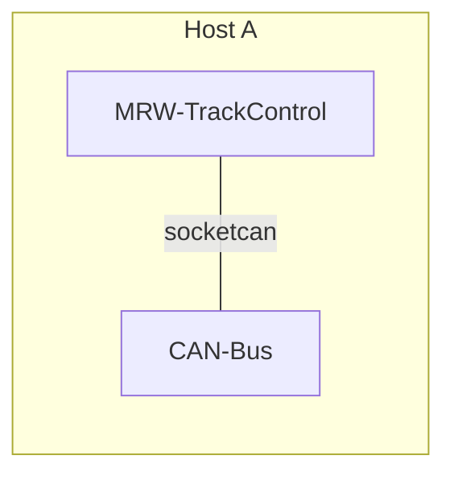
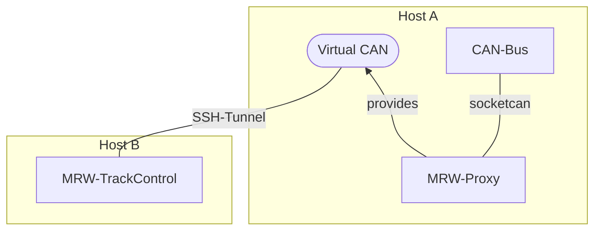
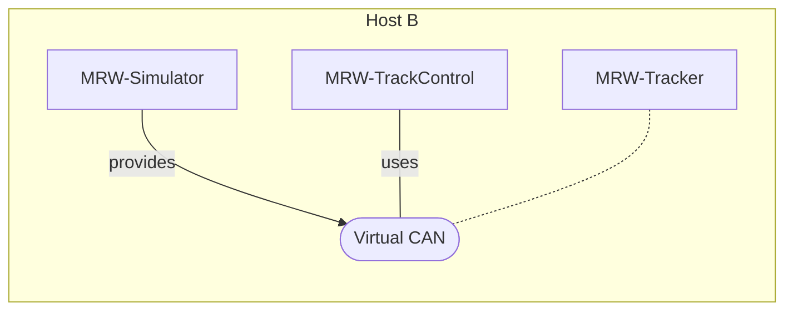

# Using the MRW track control software
The MRW-TrackControl is the central tool using a model railway based on the MRW project. To use this tool you must have prepared the following:
1. Qt with a QPA frontend configured.
2. CAN bus configured
3. Of course: the *mrw-ng* package installed.

## Basic installation on Ubuntu/Debian
If you use Debian or Ubuntu you have to do simply the steps shown on the main [README](../README.md). All dependencies are included into the *mrw-ng* package.

## CAN bus
The *mrw-ng* package does not directly install the *mrw-can* package since there is the possibility to use the software remotely. If you have a direct connected CAN bus using the Linux SocketCAN you schould install the *mrw-can* package:
```
sudo apt install mrw-can
```
This package setups the CAN bus with 125.000 Kbit/s with autostart enabled. If you are running the software on a virtual machine and are using an USB2CAN adapter you have to configure the USB bridging feature
so that the host passes the USB traffic into the virtual machine.

If you have forgotten to configure USB bridging into the VM the CAN bus is not available. After rebridging has been done you can restart the CAN bus service simply by calling:
```
sudo systemctl restart mrw-can
```
You can verify a running CAN bus by simply executing the <code>ip</code> tool:
```
root@rpi4b:~# ip -details link show can0
3: can0: <NOARP,UP,LOWER_UP,ECHO> mtu 16 qdisc pfifo_fast state UP mode DEFAULT group default qlen 1000
    link/can  promiscuity 0 minmtu 0 maxmtu 0
    can state ERROR-PASSIVE restart-ms 0
          bitrate 125000 sample-point 0.875
          tq 500 prop-seg 6 phase-seg1 7 phase-seg2 2 sjw 1
          mcp251x: tseg1 3..16 tseg2 2..8 sjw 1..4 brp 1..64 brp-inc 1
          clock 8000000 numtxqueues 1 numrxqueues 1 gso_max_size 65536 gso_max_segs 65535
```
Also if you simply call <code>ifconfig</code> and no *can0* device is listed there is no CAN bus device configured.

If you have another SocketCAN device such as *can1* you can adjust the settings in file */etc/default/mrw-can* and restart the service.

## Window Manager
If you have a system with any window manager installed, configured and started the <code>MRW-TrackControl</code> should simply start out of the box. So no more configuration is needed.

## EGLFS on Raspberry Pi4
The MRW-NG software has also an arm64 build ready to install. So you can use it directly as described on Rasberry Pi. To use *eglfs* on Raspberry Pi 4b and later you have to set three additional environment variables:
```
export QT_QPA_PLATFORM=eglfs
export QT_QPA_EGLFS_INTEGRATION=eglfs_kms
export QT_QPA_EGLFS_ALWAYS_SET_MODE="1"
```
For convenience put these calls into your *~/.profile* file.

## Starting MRW NG Track Control
You can start the track control software by executing:
```
MRW-TrackControl <railway-model>
```
Note that you don't have to add a file extension! The software lookups the
railway model file in your complete home directory. Once it is found it
remembers the location and you don't have to add the railway-model as
argument.

To create an appropriate railway model consult the pages of https://github.com/stmork/mrw/

There are a couple of scenarios possible using the different Qt plugins for using a CAN bus. The configuration is stored on a per host basis in file *$HOME/.config/mrw/model.conf*. Select the section named by your hostname and adjust the *plugin* variable. This variable takes the Qt naming of their CAN bus plugins. As stated later it could be
1. *socketcan* for directly connected CAN bus.
2. *virtualcan* for the virtual CAN bus feature of Qt

Note that there are some other plugins provided by Qt. Use them on demand.
There is additionally the variable *interface* which is by default *can0*. Change it on your demands if you have more than one CAN bus available.

### Direct usage

So the simplest scenario to start <code>MRW-TrackControl</code> is to use a directly connected CAN bus as follows:



### Remote usage

If you want to use <code>MRW-TrackControl</code> remotely you can use the <code>MRW-Proxy</code> tool which interconnects a real CAN bus (the "socketcan" plugin in Qt meaning) with a virtual CAN bus (the "virtualcan" plugin in Qt meaning). Since the virtual CAN bus can only connect to a localhost socket you need a SSH tunnel to connect remotely. You can use the command on host B to build a tunnel to host A:

```
ssh -L 35468:localhost:35468 user@host-a
```

Note that you start the <code>MRW-Proxy</code> tool first, since it provides the virtual CAN Server on socket localhost:35468.



### Simulation

If you want to simulate a model railway you can use the <code>MRW-Simulator</code> tool. This tool has to be started first, because the tool provides the virtual CAN Server on socket  localhost:35468. All following tools detect the virtual CAN bus server and connect automatically. The <code>MRW-Tracker</code> ist optional and simulates a train following a track of enabled rail sections during a selected tour/route.



## Running as a service
It is planned to run the MRW Track Control as a systemd service autostarted when booting.
