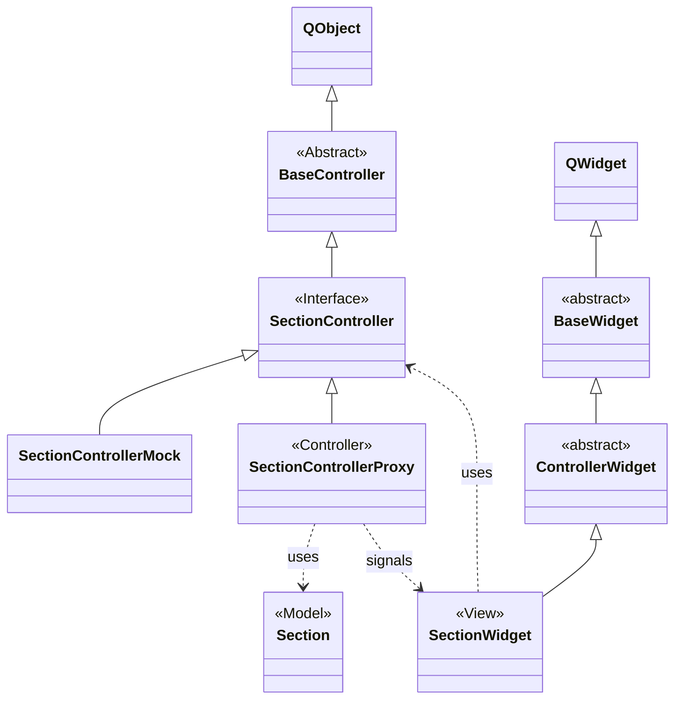

# The mrw::ui namespace

The mrw::ui namespace contains all custom widget classes needed for the MRW next generation track control. All widgets are derived from the BaseWidget class. Special classes like the BarWidget or OpModeWidget are directly derived.

All classes derived from ControllerWidget are view classes in the meaning of the MVC paradigma (see: https://en.wikipedia.org/wiki/Model%E2%80%93view%E2%80%93controller). The model contains simply the data. The view represents simply this data. Both don't talk directly but using an intermediate controller which contains a sort of business logic. Generally speaking the "view" BaseWidget does not see any model class.

The model may be any class from the mrw::model namespace, The view classes are in the mrw::ui namespace and the controller classes are in this mrw::ctrl namespace.

Actually there are four MVC groups:
1. Section - SectionController - SectionWidget
2. RegularSwitch - RegularSwitchController - RegularSwitchWidget
3. DoubleCrossSwitch - DoubleCrossSwitchController - DoubleCrossSwitchWidget
4. Signal - SignalController - SignalWidget

The MVC for signals is a little bit different because a controller may represent a group of signals like a combined main and distant signal.

## SectionWidget

As an example this scenario shows the MVC for a rail section.

